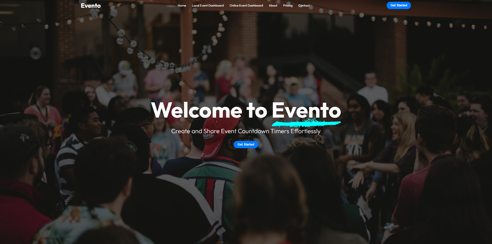

# Evento

A simple, responsive event-management website. Users can add events and see live countdowns, browse pricing, learn about the team, and find contact information.

> ## ▶ Watch a 3-minute showcase video  
> **[Click here to watch on OneDrive](https://1drv.ms/v/c/4d75d128dc6af497/EdJNE3dWKSlLh1-_Q3kE3UQB2pzd9hTj5FzLGyU5--Phuw?e=s0uSFC)**

## Hosted Live
*(free tier firebase hosting; daily serving limits may apply)*
- https://evento---cs-project.web.app/
- https://evento---cs-project.firebaseapp.com/  

## Features
- **Local Event Dashboard** — add events (title/description/date-time) and see live countdown cards.
- **Online Event Dashboard** — companion page for non-local events.
- **Interactive UI** — hover animations, sticky navbar that adapts after scrolling.
- **Pricing Page** — Individual/Team/Enterprise plans with a *test* Stripe checkout link.
- **About Us** — milestones, team, and sponsors.
- **Contact** — contact info + embedded Google Map (form placeholders).

## Tech stack
- **HTML, CSS, vanilla JavaScript**
- **Stripe** (test checkout links only)
- **Hosting:** Firebase (static site)

## Preview locally
Download this folder (or clone the repo) and open **index.html** in your browser ( Chrome is recommended).

## Resources
- **Demo video:** [Evento - Showcase - CSE104 - Mathieu Kusno.mkv](./Evento%20-%20Showcase%20-%20CSE104%20-%20Evento.mkv) · **Watch online:** [OneDrive](https://1drv.ms/v/c/4d75d128dc6af497/EdJNE3dWKSlLh1-_Q3kE3UQB2pzd9hTj5FzLGyU5--Phuw?e=s0uSFC)
- **Project report (PDF):** [Report - Mathieu Kusno - CSE104 - Evento.pdf](./Report%20-%20Mathieu%20Kusno%20-%20CSE104%20-%20Evento.pdf)

## Notes & limitations
- Time input for events may not work consistently in all browsers; Chrome is recommended.
- The contact form and email links are **non-functional placeholders** for demonstration.
- Pricing “Buy now” buttons point to **test** Stripe pages (no real charges).

## Author
Mathieu Kusno
